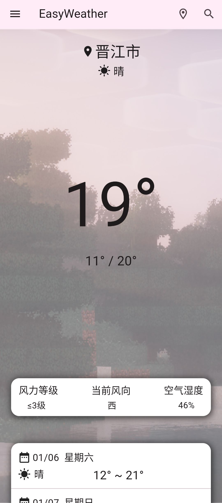
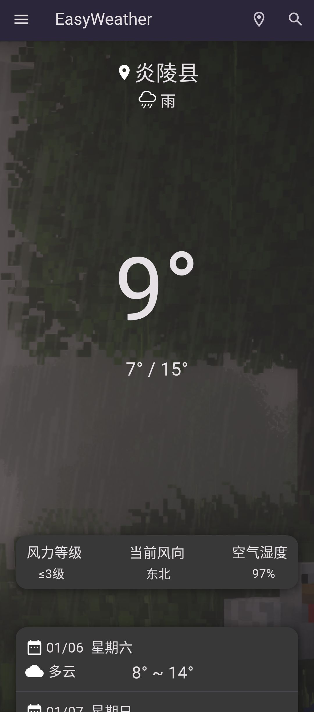

    

# EasyWeather
EasyWeather by ClaretWheel1481
 
The data is sourced from the Gaode Open Platform.
 
The background image is taken from Minecraft 1.20.2 With Nostalgia v4.0. 
 
I have read the EULA and if there is any infringement, please contact me to delete it.
## ⚠️Warning
❗️Only suitable for use in Chinese Mainland, Hong Kong, Macao and Taiwan. 
❗️Only suitable for running on Android 9.0 and Mobile Phone. 

## ➡️Getting Started
Some of the features have already been implemented.
 
### Feature： 
☑️
Current weather query
 
☑️
Store cities in the list
 
☑️
Weather forecast for the next 3 days.
 
☑️
Variable weather icons
 
☑️
Dark Mode
 
☑️
Dangerous weather warning
 
☑️
Variable weather background
 
................

## 📷Screenshot

