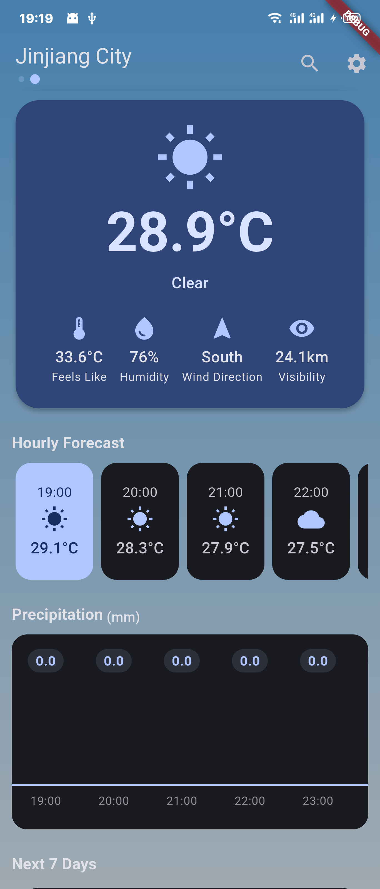
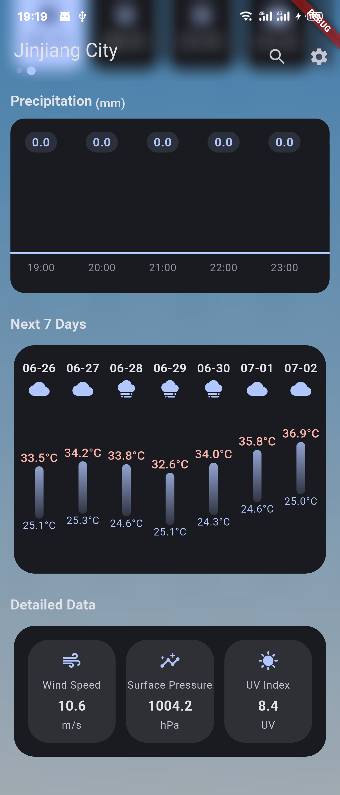
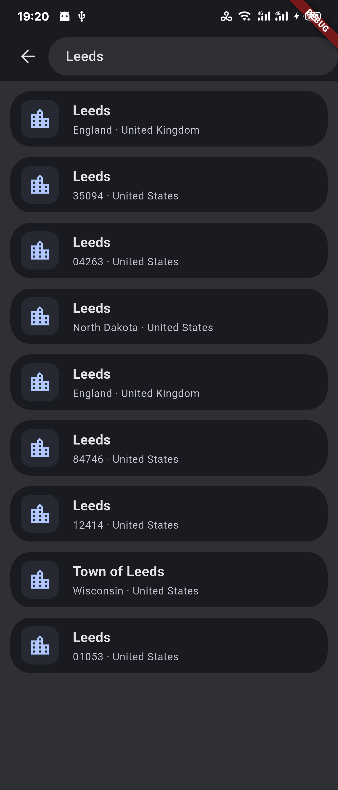
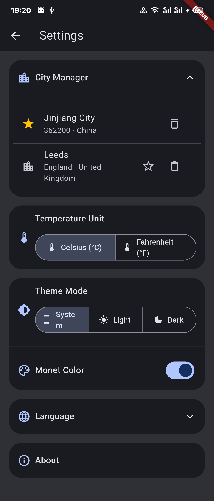

English | [简体中文](README_CN.md)

    

# EasyWeather
EasyWeather by ClaretWheel1481
 
The weather data is sourced from the OpenMeteo API.
 

# Directory
- [Warning](#Warning)
- [Features](#Features)
- [Usage](#Usage)
- [Screenshots](#Screenshots)
- [Download](#Download)
- [License](#License)

## Warning
❗️Only suitable for running on Android 9.0 and Mobile Phone. 

## Features
☑️
Current weather query
 
☑️
Store cities in the list
 
☑️
Weather forecast for the next 7 days
 
☑️
Variable weather icons
 
☑️
Theme settings (Dynamic Color avaliable)
 
☑️
Variable weather background
 
☑️
Temperature unit modification
 
☑️
l10n support
 
................

## Usage
- You can search for cities in the top right corner. Upon successful search, the corresponding results will be displayed. Select the desired city and click it to return to the main interface, showing the weather conditions and saving it to the city list.
- In the settings page, you can choose saved cities. You can set a designated city as the default city and delete cities that have been saved.

## Screenshots
<table>
  <tr>
    <td></td>
    <td></td>
  </tr>
  <tr>
    <td></td>
    <td></td>
  </tr>
</table>

## Download
[Click Here](https://github.com/ClaretWheel1481/easyweather/releases/latest)

## License
[MIT](LICENSE) © Huang LinXing