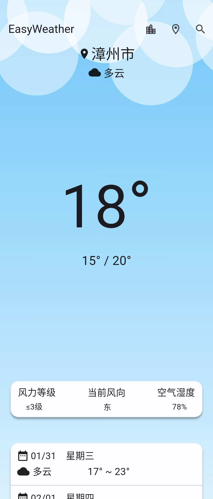
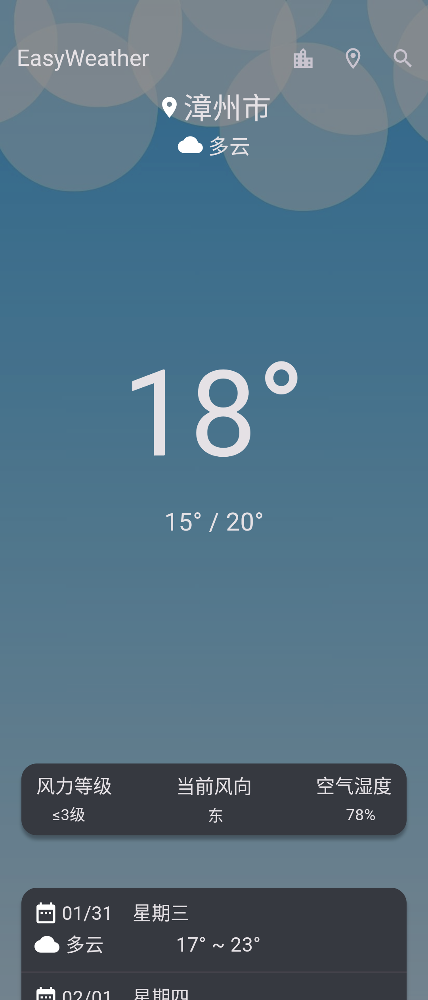

English | [简体中文](README_CN.md)

    

# EasyWeather
EasyWeather by ClaretWheel1481
 
The data is sourced from the Gaode Open Platform,QWeather Platform.
 

# Directory
- [⚠️Warning](#Warning)
- [➡️Features](#Features)
- [🍜Usage](#Usage)
- [📷Screenshots](#Screenshots)
- [📥Download](#Download)
- [📝License](#License)

## ⚠️Warning
❗️Only suitable for use in Chinese Mainland, Hong Kong, Macao and Taiwan. 
❗️Only suitable for running on Android 9.0 and Mobile Phone. 

## ➡️Features
☑️
Current weather query
 
☑️
Store cities in the list
 
☑️
Weather forecast for the next 3 days.
 
☑️
Variable weather icons
 
☑️
Dark Mode
 
☑️
Dangerous weather warning
 
☑️
Variable weather background
 
................
## 🍜Usage
- In the upper right corner, you can search for cities (limited to Chinese only). After a successful search, the corresponding results will be displayed. Select the desired city, click it to return to the main interface, display the weather situation, and save it to the city list.
- In the upper right corner, allows for location (location permission is required). If the location is successful, the weather conditions of the city will be automatically displayed and saved to the city list.
- In the upper right corner, you can select a saved city, click on the city to view its weather conditions, and long press to delete the city.
- Pull down at the top to refresh the weather.

## 📷Screenshots

## 📥Download
[Click Here](https://github.com/ClaretWheel1481/easyweather/releases/latest)

## 📄License
[MIT](LICENSE) © Huang LinXing