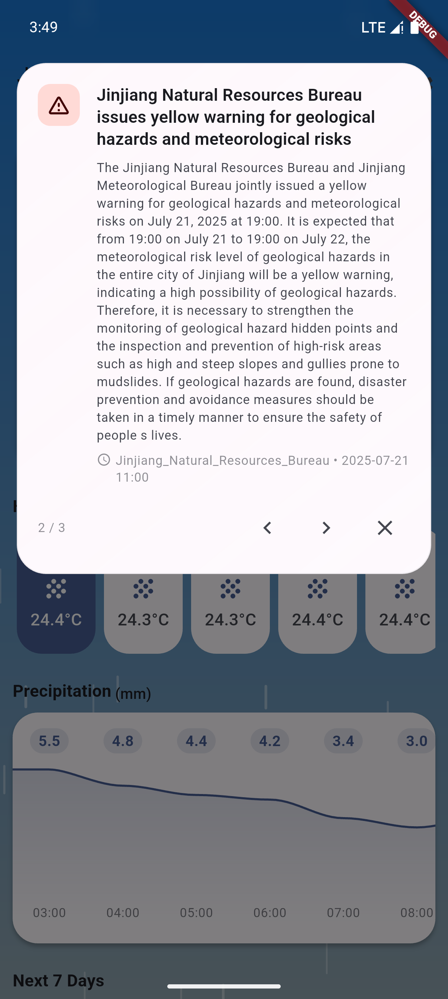
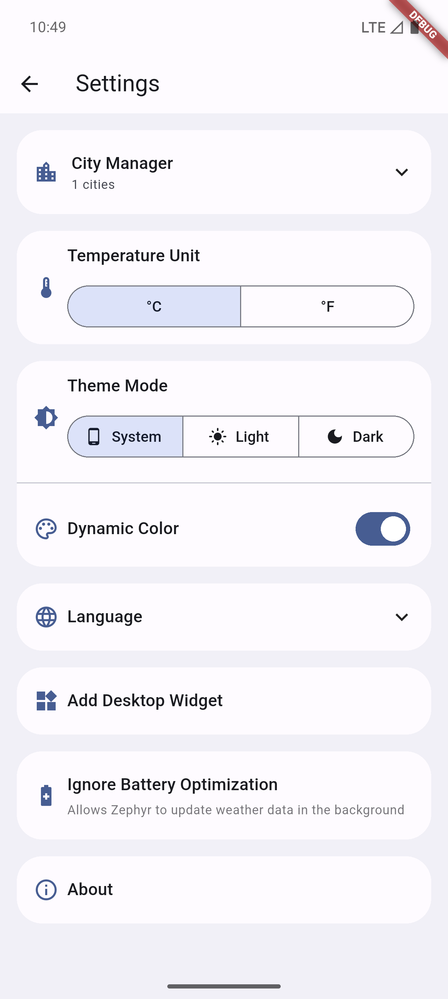
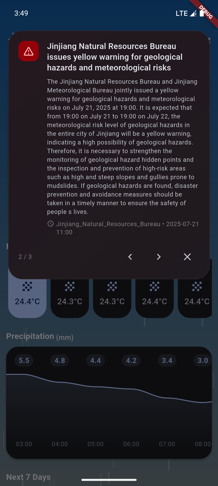

English | [简体中文](README_CN.md)

  

# Zephyr

A simple and beautiful weather app built with Flutter, powered by the OpenMeteo API and the search functionality is provided by the OpenStreetMap API.
> **Note** 
> 
> This project is only for learning and communication use, please do not use for commercial purposes. And each API has a certain dosage limit, please do not abuse.
---
## Features
- Real-time weather query for multiple cities
- City management: add, delete, set default
- 7-day weather forecast
- Weather warnings
- Dynamic weather icons and backgrounds
- Theme settings with dynamic color support
- Temperature unit switch (°C/°F)
- Localization (l10n) support

## Usage
1. Tap the search button in the top right corner to search for a city. Select a city to return to the main screen and save it to city list, or tap the location button to get weather data of your local city.
2. Manage saved cities in the settings page: set default or delete.
3. Switch theme, language, and temperature unit in settings.

## Contributing
We welcome community users to contribute! Feel free to fork this repository, submit Pull Requests, and make suggestions and report bugs through Issues.

### Translation
1. The language files are located in the /lib/l10n directory.
2. You need to make a copy of `app_en.arb` and change the name of the file to the language you want to translate, e.g. `app_fr.arb`.
3. Complete the translation of the language file
4. (Mandatory) run `flutter gen-l10n` in the project root directory in a terminal and check if there are any untranslated fields in the terminal output (if there are then check `untranslated.json` and change it)
5. Push your code and commit [Pull Request](https://github.com/ClaretWheel1481/Zephyr/pulls)

## Screenshots
<table>
  <tr>
    <td></td>
    <td></td>
    <td></td>
    <td></td>
  </tr>
  <tr>
    <td></td>
    <td></td>
    <td></td>
    <td></td>
  </tr>
</table>

## Download
[Click here to download the latest version of Zephyr](https://github.com/ClaretWheel1481/Zephyr/releases/latest)

## Acknowledgments
This project is built with the help of these amazing open-source projects and APIs:

### Frameworks & SDKs
- [Flutter](https://flutter.dev/) - UI framework
- [Dart](https://dart.dev/) - Programming language

### APIs
- [OpenMeteo API](https://open-meteo.com/) - Weather data
- [OpenStreetMap API](https://www.openstreetmap.org/) - City search

### Dependencies
- [shared_preferences](https://pub.dev/packages/shared_preferences) - Local data storage
- [http](https://pub.dev/packages/http) - HTTP requests
- [dynamic_color](https://pub.dev/packages/dynamic_color) - Material You dynamic colors
- [geolocator](https://pub.dev/packages/geolocator) - Location services
- [geocoding](https://pub.dev/packages/geocoding) - Address geocoding
- [flutter_localizations](https://flutter.dev/docs/development/accessibility-and-localization/internationalization) - Internationalization
- [home_widget](https://pub.dev/packages/home_widget) - Home widget
- [url_launcher](https://pub.dev/packages/url_launcher) - Open in browser
- [disable_battery_optimizations_latest](https://pub.dev/packages/disable_battery_optimizations_latest) - Ignore battery optimization

## License
[MIT License](LICENSE) © Huang LinXing