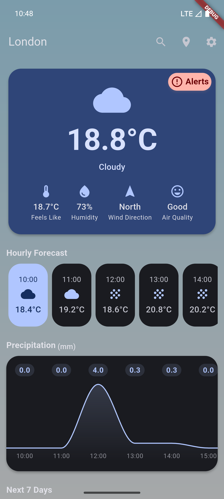

English | [简体中文](README_CN.md)

  

# EasyWeather

A simple and beautiful weather app built with Flutter, powered by the OpenMeteo API.

---

## Table of Contents
- [Warning](#warning)
- [Features](#features)
- [Usage](#usage)
- [Tech Stack](#tech-stack)
- [Screenshots](#screenshots)
- [Download](#download)
- [License](#license)

## Warning
> ⚠️ Only suitable for Android 9.0 or iOS 14 and above mobile devices.

## Features
- Real-time weather query for multiple cities
- City management: add, delete, set default
- 7-day weather forecast
- Dynamic weather icons and backgrounds
- Theme settings with dynamic color support
- Temperature unit switch (°C/°F)
- Localization (l10n) support

## Usage
1. Tap the search button in the top right corner to search for a city. Select a city to return to the main screen and save it to city list, or tap the location button to get weather data of your local city.
2. Manage saved cities in the settings page: set default or delete.
3. Switch theme, language, and temperature unit in settings.

## Tech Stack
- Flutter 3.32.4
- OpenMeteo API
- OpenStreetMap API

## Screenshots
<table>
  <tr>
    <td></td>
    <td></td>
  </tr>
  <tr>
    <td></td>
    <td></td>
  </tr>
</table>

## Download
[Click here to download the latest version of EasyWeather](https://github.com/ClaretWheel1481/easyweather/releases/latest)

## License
[MIT License](LICENSE) © Huang LinXing