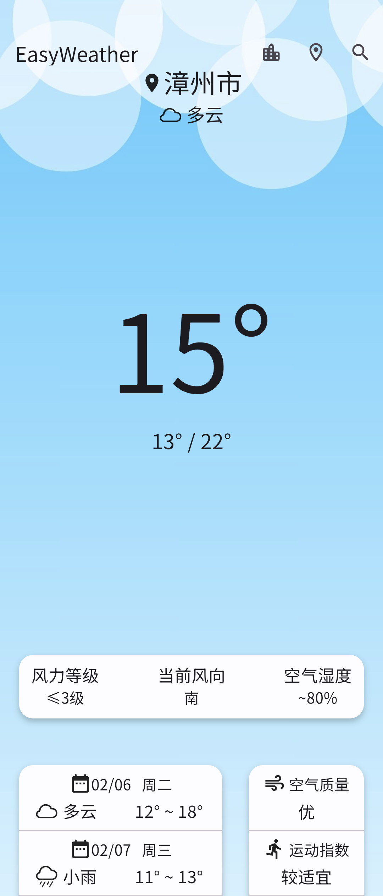
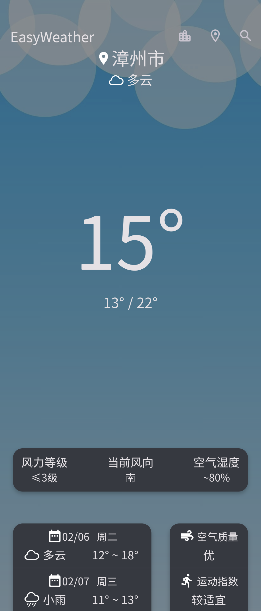

[English](README) | 简体中文

    

# EasyWeather
EasyWeather by ClaretWheel1481
 
天气数据均来源于高德开放平台与和风天气开放平台。
 

# 目录
- [⚠️警告](#警告)
- [➡️功能](#功能)
- [🍜用法](#用法)
- [📷预览](#预览)
- [📥下载](#下载)
- [📝许可证](#许可证)

## ⚠️警告
❗️仅适用于中国大陆与港澳台用户。 
❗️仅适用于搭载Android 9.0及以上的手机。 

## ➡️功能
☑️
目前天气查询
 
☑️
可存储的城市列表
 
☑️
未来三天的天气预报
 
☑️
可跟随天气变化的天气图标
 
☑️
深色模式（跟随系统设置）
 
☑️
危险天气预警
 
☑️
可跟随天气变化的天气背景
 
☑️
空气质量
 
☑️
天气指数
 
................

## 🍜用法
- 右上角可进行搜索城市（仅限于中文），搜索成功后会显示对应结果，选择想要的城市，单击后将返回主界面，显示天气情况并将其保存至城市列表中。
- 右上角可进行定位（需要定位权限），若定位成功则自动显示所在城市的天气情况，并保存至城市列表中。
- 右上角可选择已保存的城市，单击城市可查看城市的天气情况，长按可删除城市。
- 最顶部下拉可刷新天气情况。

## 📷预览

## 📥下载
[点击此处](https://github.com/ClaretWheel1481/easyweather/releases/latest)

## 📄许可证
[MIT](LICENSE) © Huang LinXing