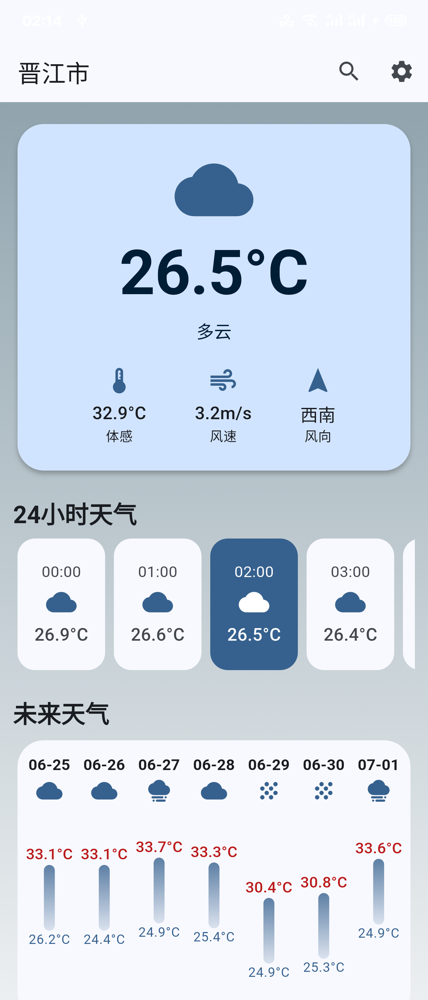

[English](README.md) | 简体中文

    

# EasyWeather
EasyWeather by ClaretWheel1481
 
天气数据均来源于OpenMeteo API。
 

# 目录
- [警告](#警告)
- [功能](#功能)
- [用法](#用法)
- [预览](#预览)
- [下载](#下载)
- [许可证](#许可证)

## 警告
❗️仅适用于搭载Android 9.0及以上的手机。 

## 功能
☑️
目前天气查询
 
☑️
可存储的城市列表
 
☑️
未来7天的天气预报
 
☑️
可跟随天气变化的天气图标
 
☑️
主题设置（支持Monet取色）
 
☑️
可跟随天气变化的天气背景
 
☑️
温度单位调整
 
☑️
多语言支持
 
................

## 用法
- 右上角可进行搜索城市，搜索成功后会显示对应结果，选择想要的城市，单击后将返回主界面，显示天气情况并将其保存至城市列表中。
- 设置页可选择已保存的城市，可将指定城市设置为默认城市，并能够删除已保存的城市。

## 预览

## 下载
[点击此处](https://github.com/ClaretWheel1481/easyweather/releases/latest)

## 许可证
[MIT](LICENSE) © Huang LinXing