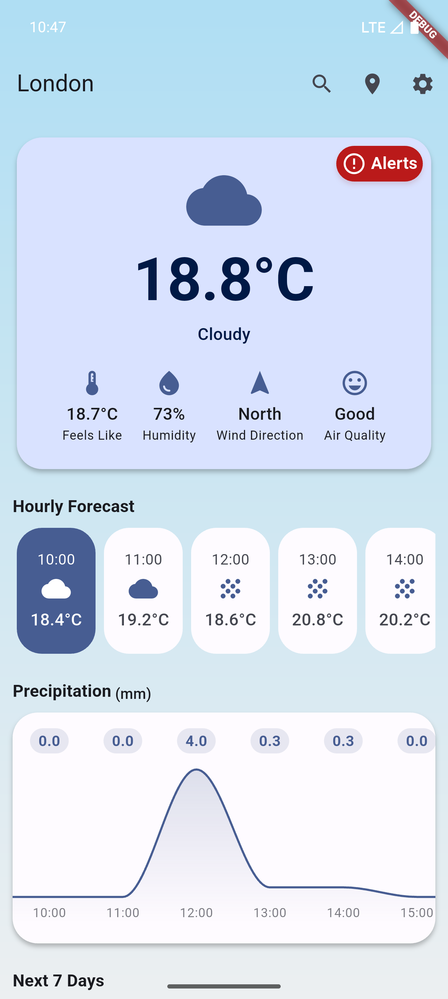
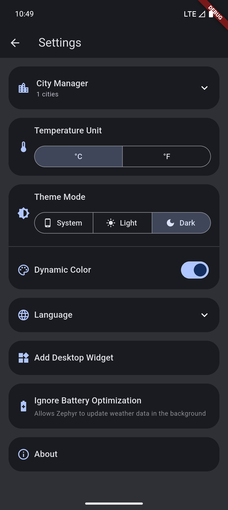

[English](README.md) | 简体中文

  

# EasyWeather

一款简洁美观的天气应用，基于 Flutter 开发，数据来源于 OpenMeteo API，搜索功能由 OpenStreetMap API 提供。

---

## 警告
> ⚠️ 仅适用于 Android 9.0 或 iOS 14 及以上的手机设备。

## 功能特性
- 实时天气查询：支持多城市天气信息获取
- 城市管理：可添加、删除、设为默认
- 7天天气预报：未来一周天气趋势一目了然
- 多样天气图标与动态背景
- 主题设置：支持Monet取色
- 温度单位切换（℃/℉）
- 多语言本地化（l10n）

## 使用方法
1. 点击右上角搜索按钮，输入城市名进行搜索，选择城市后自动返回主界面并保存至城市列表，或使用定位功能自动获取您所在地的天气信息。
2. 在设置页面可管理已保存城市，支持设为默认和删除操作。
3. 可在设置中切换主题、语言和温度单位。

## 技术栈
- Flutter 3.32.4
- OpenMeteo API
- OpenStreetMap API

## 贡献
欢迎社区用户参与贡献！您可以自由 Fork 本仓库，提交 Pull Request，或通过 Issue 提出建议和报告 Bug。

### 翻译

1. 语言文件位于/lib/l10n目录下
2. 您需要复制一份`app_en.arb`后修改文件名称为您所想翻译的语言，例如`app_fr.arb`
3. 完善语言文件的翻译
4. 在终端中在项目根目录中执行`flutter gen-l10n`
5. 推送你的代码并提交 [Pull Request](https://github.com/ClaretWheel1481/EasyWeather/pulls)

## 截图
<table>
  <tr>
    <td></td>
    <td></td>
  </tr>
  <tr>
    <td></td>
    <td></td>
  </tr>
</table>

## 下载
[点击前往 Releases 页面下载最新版本](https://github.com/ClaretWheel1481/easyweather/releases/latest)

## 致谢
本项目得益于以下优秀的开源项目和API的支持：

### 框架与SDK
- [Flutter](https://flutter.dev/) - UI框架
- [Dart](https://dart.dev/) - 编程语言

### API服务
- [OpenMeteo API](https://open-meteo.com/) - 天气数据
- [OpenStreetMap API](https://www.openstreetmap.org/) - 城市搜索

### 依赖包
- [shared_preferences](https://pub.dev/packages/shared_preferences) - 本地数据存储
- [http](https://pub.dev/packages/http) - HTTP请求
- [dynamic_color](https://pub.dev/packages/dynamic_color) - Material You动态色彩
- [geolocator](https://pub.dev/packages/geolocator) - 定位服务
- [geocoding](https://pub.dev/packages/geocoding) - 地址地理编码
- [flutter_localizations](https://flutter.dev/docs/development/accessibility-and-localization/internationalization) - 国际化支持

## 许可
[MIT License](LICENSE) © Huang LinXing